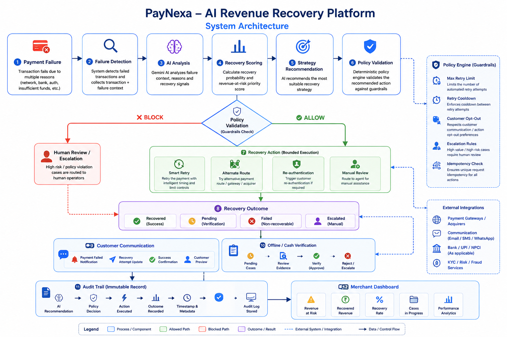

<div align="center">


# 💳 PayNexa — AI Revenue Recovery Platform

### AI-Assisted Payment Failure Intelligence & Revenue Recovery

<p>
  <strong>Detect Risk • Prioritize Recovery • Validate Actions • Recover Revenue • Audit Every Decision</strong>
</p>

<p>
  <a href="https://paynexa27.ai.studio">🚀 Live Demo</a>
  &nbsp;&nbsp;•&nbsp;&nbsp;
  <a href="https://github.com/hafsashaikh27/paynexa-ai-revenue-recovery">💻 GitHub Repository</a>
</p>

<p>
  Built for <strong>Razorpay AI Buildathon 2026</strong> • AI Revenue Recovery Track
</p>

</div>

---

## 📑 Table of Contents

- [Overview](#-overview)
- [Problem Statement](#-problem-statement)
- [Solution](#-solution)
- [Why PayNexa](#-why-paynexa)
- [Core Workflow](#-core-workflow)
- [System Architecture](#️-system-architecture)
- [Key Features](#-key-features)
- [AI & Decision Intelligence](#-ai--decision-intelligence)
- [Revenue Recovery Engine](#-revenue-recovery-engine)
- [Policy Guardrails](#️-policy-guardrails)
- [Customer Communications](#-customer-communications)
- [Offline Payment Verification](#-offline-payment-verification)
- [Recovery Strategy Experiments](#-recovery-strategy-experiments)
- [Audit Trail & Safety](#-audit-trail--safety)
- [Merchant Dashboard](#-merchant-dashboard)
- [Technology Stack](#️-technology-stack)
- [Demo Metrics](#-demo-metrics)
- [Project Structure](#-project-structure)
- [Demo Walkthrough](#-demo-walkthrough)
- [Security & Responsible AI](#-security--responsible-ai)
- [Current Limitations](#️-current-limitations)
- [Future Scope](#-future-scope)
- [Razorpay AI Buildathon Alignment](#-razorpay-ai-buildathon-2026-alignment)
- [Team](#-team)
- [Project Links](#-project-links)
- [Disclaimer](#-disclaimer)

---

# 📌 Overview

**PayNexa** is an AI-assisted revenue recovery platform designed to help merchants identify failed payments, determine which transactions are most recoverable, recommend suitable recovery strategies, validate those recommendations through deterministic policy guardrails, and track the resulting outcomes.

Instead of treating every failed payment equally, PayNexa focuses on identifying **recoverable revenue opportunities** and converting them into a structured, measurable recovery workflow.

The platform brings together:

- 🤖 AI-assisted payment failure analysis
- 📊 Recovery probability and risk scoring
- 🎯 Recovery strategy recommendations
- 🛡️ Deterministic policy guardrails
- ⚡ Bounded recovery actions
- 💬 Customer communication workflows
- 🧾 Offline / cash payment verification
- 🧪 Recovery strategy experiments
- 📋 Audit trail and decision traceability
- 📈 Merchant revenue analytics
- 🤖 AI Copilot for merchant operations

### Core Principle

> **AI recommends → Policy validates → Bounded action executes → Outcome is recorded → Audit trail is maintained**

PayNexa is designed as a **buildathon/demo implementation**. Payment execution, recovery outcomes, experiments, and financial values shown in the application are simulated/demo data unless explicitly stated otherwise.

---

# 🎯 Problem Statement

Payment failures can represent a significant source of potentially recoverable revenue for merchants.

Transactions may fail because of:

- Network timeouts
- Bank-side failures
- Insufficient funds
- Authentication failures
- UPI failures
- Gateway or acquirer issues
- Temporary infrastructure problems
- Customer verification requirements
- Other transaction-specific failure conditions

However, simply detecting a failed payment is not enough.

A merchant also needs to understand:

- Which failed transactions are worth recovering?
- Which cases should be prioritized?
- Why did the payment fail?
- How likely is recovery?
- Which intervention should be attempted?
- When should a retry occur?
- When should automated recovery stop?
- Which cases require human review?
- How much revenue has been recovered?
- What decisions were made and why?

Traditional recovery workflows can become fragmented across payment systems, customer communication, manual operations, and analytics.

**PayNexa addresses this problem by creating a unified AI-assisted revenue recovery workflow with deterministic controls and measurable outcomes.**

---

# 💡 Solution

PayNexa connects payment failure intelligence with recovery decision-making, policy validation, bounded execution, outcome tracking, and merchant analytics.

### Recovery Decision Model

```text
                 PAYMENT FAILURE
                        │
                        ▼
                FAILURE DETECTION
                        │
                        ▼
                  AI ANALYSIS
                        │
                        ▼
                RECOVERY SCORING
                        │
                        ▼
             STRATEGY RECOMMENDATION
                        │
                        ▼
                POLICY VALIDATION
                        │
                 ┌──────┴──────┐
                 │             │
               BLOCK         ALLOW
                 │             │
                 ▼             ▼
          HUMAN REVIEW    BOUNDED ACTION
                              │
                              ▼
                       RECOVERY OUTCOME
                              │
                  ┌───────────┴───────────┐
                  ▼                       ▼
          COMMUNICATION             VERIFICATION
                  │                       │
                  └───────────┬───────────┘
                              ▼
                        AUDIT TRAIL
                              │
                              ▼
                     MERCHANT DASHBOARD
````

The key design principle is that **AI recommendations are not unrestricted execution commands**.

AI assists with reasoning and recommendations, while deterministic rules provide the control layer before an action is allowed.

---

# 🚀 Why PayNexa?

| Capability               | Traditional Recovery | PayNexa               |
| ------------------------ | -------------------- | --------------------- |
| Failed Payment Detection | ✅                    | ✅                     |
| Recovery Prioritization  | Limited              | ✅ AI-Assisted         |
| Recovery Probability     | Limited              | ✅                     |
| Strategy Recommendation  | Manual / Fixed       | ✅ AI-Assisted         |
| Retry Controls           | Basic                | ✅ Policy Guardrails   |
| Customer Communication   | Separate             | ✅ Integrated Workflow |
| Offline Verification     | Manual               | ✅ Structured Workflow |
| Strategy Experimentation | Limited              | ✅                     |
| Audit Trail              | Fragmented           | ✅ Centralized         |
| Human Escalation         | Manual               | ✅ Policy-Based        |
| Merchant Analytics       | Basic                | ✅                     |
| AI Copilot               | ❌                    | ✅                     |

---

# 🔄 Core Workflow

PayNexa follows an end-to-end recovery workflow.

### 1️⃣ Payment Failure

A transaction fails due to a payment, network, bank, authentication, or other failure condition.

### 2️⃣ Failure Detection

The failed transaction and available contextual information are identified.

### 3️⃣ AI Analysis

The AI layer analyzes available failure information and identifies relevant recovery signals.

### 4️⃣ Recovery Scoring

A recovery probability or priority score is used to identify transactions that may be suitable for recovery.

### 5️⃣ Strategy Recommendation

PayNexa recommends a recovery strategy based on the transaction context.

### 6️⃣ Policy Validation

The recommendation is evaluated against deterministic guardrails.

### 7️⃣ Bounded Recovery

If the action is allowed, the corresponding recovery workflow can be triggered within defined limits.

### 8️⃣ Recovery Outcome

The transaction moves toward an outcome such as:

* ✅ Recovered
* 🟡 Pending Verification
* ❌ Failed / Non-Recoverable
* 👤 Escalated

### 9️⃣ Communication / Verification

The workflow can generate communication records or route cases through offline verification.

### 🔟 Audit Logging

Important decisions, actions, and outcomes are recorded in the audit workflow.

### 1️⃣1️⃣ Merchant Dashboard

The merchant receives a centralized view of revenue at risk, recovered revenue, recovery performance, and active cases.

---

# 🏗️ System Architecture

PayNexa follows an **AI-assisted but policy-controlled architecture**.

The complete visual architecture is provided in:

**`architecture.png`**

<div align="center">



</div>

### Architecture Layers

| Layer                      | Responsibility                                               |
| -------------------------- | ------------------------------------------------------------ |
| 💳 Payment Event           | Represents incoming payment/transaction events               |
| 🔍 Failure Detection       | Identifies failed transactions and gathers available context |
| 🤖 AI Analysis             | Analyzes failure reasons and recovery signals                |
| 📊 Recovery Scoring        | Estimates recovery opportunity and priority                  |
| 🎯 Strategy Recommendation | Recommends a suitable intervention                           |
| 🛡️ Policy Engine          | Applies deterministic rules before execution                 |
| ⚡ Recovery Action          | Performs an allowed bounded recovery workflow                |
| 📈 Recovery Outcome        | Records the resulting transaction state                      |
| 💬 Communication           | Handles merchant-side communication workflow                 |
| 🧾 Verification            | Handles offline/cash verification cases                      |
| 📋 Audit Trail             | Records important decisions and outcomes                     |
| 📊 Merchant Dashboard      | Displays recovery and revenue analytics                      |

### Policy Engine

The Policy Engine represents the deterministic control layer between AI recommendations and recovery execution.

Core controls include:

* Maximum automated retries
* Retry cooldown
* Customer opt-out
* Escalation threshold
* Idempotency protection
* Human review

### Architecture Philosophy

```text
                 ┌─────────────────────┐
                 │    AI Intelligence  │
                 │ Analysis & Reasoning │
                 └──────────┬──────────┘
                            │
                            ▼
                 ┌─────────────────────┐
                 │   Policy Engine     │
                 │ Deterministic Rules │
                 └──────────┬──────────┘
                            │
                     ┌──────┴──────┐
                     │             │
                   ALLOW         BLOCK
                     │             │
                     ▼             ▼
              Bounded Action   Human Review
                     │
                     ▼
               Outcome + Audit
```

> **AI decides what may be useful. Policy determines what is allowed.**

### External Integrations

The architecture may represent interaction with:

* Payment gateways / acquirers
* Communication channels
* Bank / UPI services where applicable
* Risk / fraud services
* Verification services

These should be considered **simulated/demo integrations** unless an actual integration is implemented.

---

# ⭐ Key Features

## 📊 Executive Overview

The Executive Overview acts as the merchant's central payment recovery control center.

It provides:

* Total Transaction Value
* Revenue at Risk
* Recovered Revenue
* Recovery Rate
* Transaction History
* High-Priority Recovery Queue
* Offline Verification Cases
* Recovery Performance
* Payment Rail Distribution
* AI Copilot

### Current Demo Metrics

| Metric                    |     Value |
| ------------------------- | --------: |
| Total Transaction Value   | ₹8,60,345 |
| Revenue Currently at Risk | ₹2,87,948 |
| Recovered Revenue         | ₹5,72,397 |
| Recovery Rate             |     66.5% |
| Total Transactions        |        28 |
| Settled Transactions      |        13 |

> These values are **demo/simulation values** and do not represent real merchant revenue.

### Metric Definitions

**Total Transaction Value**

Represents the total merchant transaction value represented in the demo dataset.

**Revenue at Risk**

Represents the amount that remains at risk in the current demonstration state.

**Recovered Revenue**

Represents the amount recovered through the simulated recovery workflow.

**Recovery Rate**

Represents the proportion of initially at-risk revenue recovered in the demonstration workflow.

---

# 🔎 Revenue at Risk Explorer

The Revenue at Risk Explorer allows operators to investigate individual recovery opportunities.

A recovery case can include:

* Case ID
* Customer
* Merchant
* Amount at Risk
* Payment Rail
* Failure Diagnostic
* Recovery Probability
* Priority
* Status
* Recovery Action

### Filters

Operators can filter cases by:

* Case Status
* Risk Priority
* Failure Reason
* Payment Rail

### Sorting

Cases can be organized using:

* Date
* Amount
* Recovery Score

The objective is to quickly answer:

> **Which failed transaction should be prioritized?**

> **Why is it considered recoverable?**

> **What action should be attempted?**

> **Does the case require human intervention?**

> Recovery probability values in the demo may represent simulated or heuristic scoring rather than a production-trained predictive model.

---

# ⚡ Recovery Action Center

The Recovery Action Center represents the operational execution layer.

### 🔄 Smart Retry

Represents a controlled retry strategy based on defined retry timing and limits.

### 🔀 Alternate Route

Represents an alternative payment route, gateway, or acquirer strategy.

### 🔐 Customer Re-authentication

Represents an additional customer verification or re-authentication workflow.

### 👤 Manual Review & Escalation

Routes cases requiring human judgment to an operator.

### Guardrail Validation

Before an action is triggered, the system can validate:

* Retry limits
* Cooldown period
* Customer opt-out
* Escalation rules
* Idempotency

> Recovery actions shown in the demo are simulated and do not perform real financial transactions.

---

# 🤖 AI & Decision Intelligence

PayNexa uses AI-assisted decision intelligence to support payment recovery operations.

The AI layer can help:

* Analyze failed payments
* Understand failure context
* Identify recovery signals
* Prioritize transactions
* Explain why a transaction is at risk
* Recommend recovery strategies
* Identify cases requiring human review
* Summarize recovery performance
* Estimate recoverable revenue from demo data

### AI Decision Flow

```text
Transaction Context
        ↓
Failure Analysis
        ↓
Recovery Signals
        ↓
Recovery Score
        ↓
Strategy Recommendation
        ↓
Deterministic Policy Validation
        ↓
┌───────────────┐
│               │
▼               ▼
ALLOWED       ESCALATED
│               │
▼               ▼
Recovery       Human
Action         Review
```

### PayNexa AI Copilot

The AI Copilot provides operator-oriented assistance through prompts such as:

* Which transactions should I prioritize?
* Why is this transaction at risk?
* What is causing the most revenue loss?
* How much revenue is currently recoverable?
* Which cases require human review?
* Summarize today's recovery performance.

> **AI is an assistant, not unrestricted financial execution authority.**

---

# 💰 Revenue Recovery Engine

The PayNexa recovery engine focuses on selecting an appropriate intervention for failed transactions.

## Smart Retry

Retry a payment while respecting:

* Retry limits
* Cooldown periods
* Customer preferences
* Policy constraints

## Alternate Route

Represent an alternative payment route when the current route may be contributing to failure.

## Customer Re-authentication

Request additional customer verification when appropriate.

## Manual Review

Escalate cases where automated recovery should not continue.

### Recovery Strategy

```text
Failed Payment
      ↓
Analyze Failure
      ↓
Estimate Recoverability
      ↓
Select Strategy
      ↓
Validate Policy
      ↓
Execute Allowed Action
      ↓
Measure Outcome
```

---

# 🛡️ Policy Guardrails

PayNexa separates **AI reasoning** from **action authorization**.

The Policy Engine provides deterministic controls that constrain recovery automation.

## 🔢 Maximum Automated Retries

Limits the number of automated recovery attempts.

## ⏱️ Retry Cooldown

Prevents repeated recovery attempts from occurring too frequently.

## 🚫 Customer Opt-Out

Prevents recovery communication or actions where the customer has opted out.

## 👤 Escalation Rules

Allows sensitive or high-value cases to be routed for human review.

## 🔐 Idempotency

Helps prevent duplicate execution of the same recovery request.

### Policy Decision

```text
                AI Recommendation
                       │
                       ▼
               ┌──────────────┐
               │ Policy Engine│
               └──────┬───────┘
                      │
                ┌─────┴─────┐
                │           │
              ALLOW       BLOCK
                │           │
                ▼           ▼
         Recovery Action  Human Review
```

This design demonstrates an important principle for financial automation:

> **AI recommendations should remain subject to deterministic operational controls.**

---

# 💬 Customer Communications

PayNexa includes a **merchant-side communication interface** for demonstrating how payment recovery communication can be managed.

The communication workflow can represent:

* Payment failure notifications
* Recovery attempt updates
* Successful payment confirmations
* Recovery messages
* Pending customer responses
* Payment confirmation
* Offline verification communication
* Customer preview

### Communication Workflow

```text
Payment Event
      ↓
Recovery Decision
      ↓
Communication Workflow
      ↓
Merchant Communication Log
      ↓
Customer Preview
```

The interface demonstrates how automated communication can fit into the recovery workflow.

> **Demo Note:** Communication delivery is represented through simulated delivery / customer preview unless a real external messaging integration is implemented.

---

# 🧾 Offline Payment Verification

Not every payment recovery case should be completely automated.

PayNexa includes an offline/cash verification workflow for cases where manual confirmation may be required.

### Verification Workflow

```text
Pending Case
     ↓
Review Evidence
     ↓
Verify / Approve
     ↓
┌──────────────┴──────────────┐
│                             │
▼                             ▼
Approved                Reject / Escalate
│                             │
▼                             ▼
Update Outcome           Human Review
      └──────────────┬──────────────┘
                     ↓
                Audit Trail
```

The workflow can support:

* Pending cases
* Case evidence
* Verification
* Approval
* Rejection
* Escalation
* Communication updates
* Audit recording

This demonstrates how manual verification can coexist with an AI-assisted recovery system.

---

# 🧪 Recovery Strategy Experiments

PayNexa includes an experimentation module designed to demonstrate how different recovery strategies can be evaluated against baseline approaches.

The current experiments use a **simulation dataset**.

### Example Experiments

| # | Experiment                                            |
| - | ----------------------------------------------------- |
| 1 | Adaptive Smart Retry vs Fixed 4-Hour Dunning          |
| 2 | WhatsApp 1-Click UPI Intent vs Standard Email Dunning |
| 3 | Dynamic Gateway Routing on Bank Latency Spikes        |
| 4 | Salary-Cycle Aligned Recovery                         |

### Example Demo Results

| Strategy                    | Demo Lift |
| --------------------------- | --------: |
| Adaptive Smart Retry        |    +19.2% |
| WhatsApp 1-Click UPI Intent |    +32.3% |
| Dynamic Gateway Routing     |    +24.4% |
| Salary-Cycle Recovery       |    +27.4% |

### Experiment Metrics

The module can demonstrate:

* Control recovery rate
* Variant recovery rate
* Incremental lift
* Eligible transactions
* Estimated incremental recovery
* Strategy comparison

> **Evidence Type: Synthetic Simulation**

The experiment module demonstrates the concept of evaluating recovery strategies before considering deployment.

It should **not** be interpreted as production A/B-test evidence.

> If statistical significance is not actually calculated by the application, confidence levels and p-values should not be presented as real statistical evidence.

---

# 📋 Audit Trail & Safety

PayNexa includes an audit-oriented workflow for important recovery decisions.

### Audit Sequence

```text
AI Recommendation
       ↓
Policy Decision
       ↓
Action Executed
       ↓
Outcome Recorded
       ↓
Timestamp + Metadata
       ↓
Audit Record
```

Important events can include:

* AI recommendation
* Policy validation
* Recovery action
* Customer re-authentication
* Human escalation
* Recovery outcome
* Verification result
* Communication event

### Safety Architecture

```text
AI Intelligence
      ↓
Deterministic Policy
      ↓
Bounded Execution
      ↓
Outcome Verification
      ↓
Auditability
```

> 🔒 **Demo Simulation Mode:** No live payment network debiting or real-money transfer occurs through this demonstration.

---

# 📈 Merchant Dashboard

The Merchant Dashboard provides a centralized operational view of payment recovery.

### Dashboard Metrics

* 💰 Total Transaction Value
* ⚠️ Revenue at Risk
* ✅ Recovered Revenue
* 📊 Recovery Rate
* 📁 Cases in Progress
* 📈 Recovery Performance
* 💳 Payment Rail Distribution
* 🎯 High-Priority Recovery Queue
* 🤖 AI Copilot

The dashboard allows merchants to understand:

**Where revenue is at risk**

and

**Where recovery opportunities exist.**

---

# 🧠 PayNexa Recovery Philosophy

PayNexa is built around five core principles.

### 1. Detect

Identify failed and potentially recoverable transactions.

### 2. Understand

Analyze the available failure context and recovery signals.

### 3. Decide

Recommend the most appropriate recovery strategy.

### 4. Control

Apply deterministic guardrails before execution.

### 5. Learn

Measure outcomes and compare recovery strategies.

### Closed-Loop Recovery

```text
Detect
  ↓
Analyze
  ↓
Score
  ↓
Recommend
  ↓
Validate
  ↓
Act
  ↓
Measure
  ↓
Audit
  ↓
Improve
```

---

# 📊 Demo Metrics

The current demonstration dataset includes:

| Metric                    |     Value |
| ------------------------- | --------: |
| Total Transaction Value   | ₹8,60,345 |
| Revenue Currently at Risk | ₹2,87,948 |
| Recovered Revenue         | ₹5,72,397 |
| Recovery Rate             |     66.5% |
| Total Transactions        |        28 |
| Settled Transactions      |        13 |

### Revenue Breakdown

```text
Total Transaction Value
₹8,60,345
       │
       ├───────────────► Recovered Revenue
       │                 ₹5,72,397
       │
       └───────────────► Current Revenue at Risk
                         ₹2,87,948
```

> All financial figures shown above are **demo/simulation values**.

---

# 🧩 Technology Stack

| Category        | Technology                   |
| --------------- | ---------------------------- |
| AI              | Google Gemini                |
| AI Development  | Google AI Studio             |
| Frontend        | React / TypeScript           |
| Backend         | Node.js / API Layer          |
| Data Storage    | SQLite / Local Data          |
| Version Control | GitHub                       |
| Styling         | CSS / UI Framework           |
| Deployment      | AI Studio / Cloud Deployment |

> The technology stack should always reflect the actual implementation in the repository. Technologies that are not implemented should not be presented as implemented features.

---

# 🗂️ Project Structure

The repository contains the project documentation, branding assets, architecture visualization, and application source code.

```text
paynexa-ai-revenue-recovery/
│
├── README.md
├── logo.png
├── architecture.png
├── .env.example
│
├── src/
│   ├── components/
│   ├── pages/
│   ├── services/
│   └── ...
│
├── public/
│   └── ...
│
└── ...
```

> The exact structure depends on the current implementation of the repository.

---


### Responsible AI Principles

PayNexa emphasizes:

* Human oversight
* Deterministic policy controls
* Retry limits
* Cooldown periods
* Customer opt-out handling
* Escalation for sensitive cases
* Idempotency protection
* Auditability
* Transparent demo labeling
* Synthetic/demo data

The platform does not rely on unrestricted AI execution for financial actions.

---

# ⚠️ Current Limitations

PayNexa is currently a **buildathon/demo implementation**.

The following limitations apply:

* Payment execution is simulated.
* Recovery metrics use demo/synthetic data.
* Recovery probabilities may use simulated or heuristic scoring.
* Customer communication is demonstrated through merchant-side logs and previews.
* Gateway/acquirer routing is simulated unless an actual integration is implemented.
* Offline verification is demonstrated as a workflow.
* Experiment results are based on simulation data.
* No real money is transferred through the application.

These limitations are intentional for the demonstration environment.

> The objective is to demonstrate the **AI-assisted recovery architecture, decision workflow, bounded automation, safety controls, measurement, and auditability** rather than process live financial transactions.

---

# 🔮 Future Scope

PayNexa can be extended into a production-grade revenue recovery platform.

## 💳 Payment Infrastructure

* Real payment gateway integrations
* Real-time payment telemetry
* Multi-acquirer optimization
* Intelligent payment routing

## 🤖 Advanced AI / ML

* Production-trained recovery prediction models
* Personalized recovery strategies
* Customer behavior modeling
* Continuous model evaluation
* Adaptive strategy selection

## 💬 Communication

* Real WhatsApp integration
* SMS integration
* Email integration
* Personalized payment recovery links

## 🛡️ Risk & Security

* Fraud-aware recovery decisions
* Stronger idempotency infrastructure
* Role-based access control
* Production-grade audit storage

## 🧪 Experimentation

* Real-time A/B experimentation
* Automated strategy evaluation
* Continuous optimization
* Merchant-level experimentation

## 📊 Analytics

* Advanced merchant analytics
* Revenue forecasting
* Cohort-level recovery analysis
* Payment failure trend analysis

---

# 🏆 Razorpay AI Buildathon 2026 Alignment

PayNexa is designed around the **AI Revenue Recovery** problem.

The central objective is:

> **Find revenue that is slipping away and win it back.**

PayNexa maps this objective to the following capabilities:

| Buildathon Requirement         | PayNexa Implementation          |
| ------------------------------ | ------------------------------- |
| Detect revenue at risk         | Revenue at Risk Explorer        |
| Determine recovery opportunity | Recovery Scoring                |
| Prioritize recoverable cases   | Recovery Priority               |
| Select intervention            | AI Strategy Recommendation      |
| Execute recovery workflow      | Recovery Action Center          |
| Use bounded automation         | Deterministic Policy Guardrails |
| Stop unsafe retries            | Retry Limits + Cooldown         |
| Respect customer preferences   | Customer Opt-Out                |
| Escalate sensitive cases       | Human Review                    |
| Measure recovery               | Recovery Dashboard              |
| Compare strategies             | Recovery Experiments            |
| Maintain traceability          | Audit Trail                     |
| Handle manual cases            | Offline Verification            |

### Buildathon Concept

```text
Failed Payment
      ↓
AI Analysis
      ↓
Recovery Probability
      ↓
Strategy Recommendation
      ↓
Policy Engine
      ↓
   ┌───────┐
   │ALLOW? │
   └───┬───┘
       │
   ┌───┴────┐
   │        │
  YES       NO
   │        │
   ▼        ▼
Recovery  Human
Action    Review
   │
   ▼
Outcome
   │
   ▼
Audit Trail
   │
   ▼
Merchant Dashboard
```

### Key Buildathon Principle

> **The AI can reason about what should happen, but deterministic controls decide what is allowed to happen.**

This enables PayNexa to demonstrate a recovery workflow that combines:

**Intelligence + Control + Measurement + Accountability**

---

# 🌟 What Makes PayNexa Different?

PayNexa is not positioned as a simple failed-payment dashboard.

It combines:

```text
AI Intelligence
      +
Recovery Scoring
      +
Strategy Selection
      +
Policy Guardrails
      +
Bounded Automation
      +
Customer Communication
      +
Offline Verification
      +
Experimentation
      +
Auditability
```

This creates a complete revenue recovery operating workflow.

---

# 📌 Product Philosophy

PayNexa follows three core principles.

## 🧠 Intelligence

Use AI to understand payment failures and recommend suitable recovery strategies.

## 🛡️ Control

Use deterministic rules to prevent unrestricted automated actions.

## 📋 Accountability

Record important decisions and outcomes so that the recovery process remains traceable.

### The Principle

> **Intelligence without control is risky.**
> **Control without intelligence is rigid.**
> **PayNexa combines both with auditability.**

---

# 👩‍💻 Team

## Hafsa Shaikh

**Project Developer / Builder**

Key responsibilities include:

* Product concept
* PayNexa application
* AI-assisted recovery workflow
* Merchant dashboard
* Recovery logic
* Policy guardrails
* Customer communication interface
* Offline verification workflow
* Recovery experiments
* Audit trail
* Project documentation

---

# 🔗 Project Links

### 🚀 Live Demo

[https://paynexa27.ai.studio](https://paynexa27.ai.studio)

### 💻 GitHub Repository

[https://github.com/hafsashaikh27/paynexa-ai-revenue-recovery](https://github.com/hafsashaikh27/paynexa-ai-revenue-recovery)

### 🏆 Razorpay AI Buildathon

[https://razorpay.com/buildathon/](https://razorpay.com/buildathon/)

---

# 📸 Project Modules

| Module                     | Purpose                             |
| -------------------------- | ----------------------------------- |
| 📊 Executive Overview      | Central merchant recovery dashboard |
| 💬 Customer Communications | Recovery communication workflow     |
| ⚠️ Revenue at Risk         | Recovery opportunity explorer       |
| ⚡ Recovery Action Center   | Bounded recovery execution          |
| 🤖 AI Assistant            | Operator decision support           |
| 🧪 Experiments             | Recovery strategy evaluation        |
| 📋 Audit Trail             | Decision traceability               |
| ⚙️ Settings                | Policy and platform configuration   |

---

# 🚦 Demo Status

<div align="center">

### 🟢 PAYNEXA DEMO OPERATIONAL

**AI-Assisted Recovery • Policy Guardrails • Simulated Recovery • Audit Workflow**

</div>

The current version is intended for demonstration and buildathon evaluation.

---

# 📜 Disclaimer

PayNexa is a **buildathon/demo project** created to demonstrate an AI-assisted revenue recovery workflow.

The application uses simulated/demo payment events and does not perform real payment debits or transfers.

Recovery metrics, experiments, recovery probabilities, and other financial values shown in the interface should be interpreted as demonstration data unless explicitly stated otherwise.

No real customer financial information should be used in the demonstration environment.

---

<div align="center">

# 💳 PayNexa

### **Recover Smarter. Act Safely. Measure Everything.**

Built for **Razorpay AI Buildathon 2026**

<br>

**AI Recommendation → Policy Validation → Bounded Recovery → Measured Outcome → Audit Trail**

<br>

⭐ If you find the concept interesting, consider starring the repository.

</div>
```
